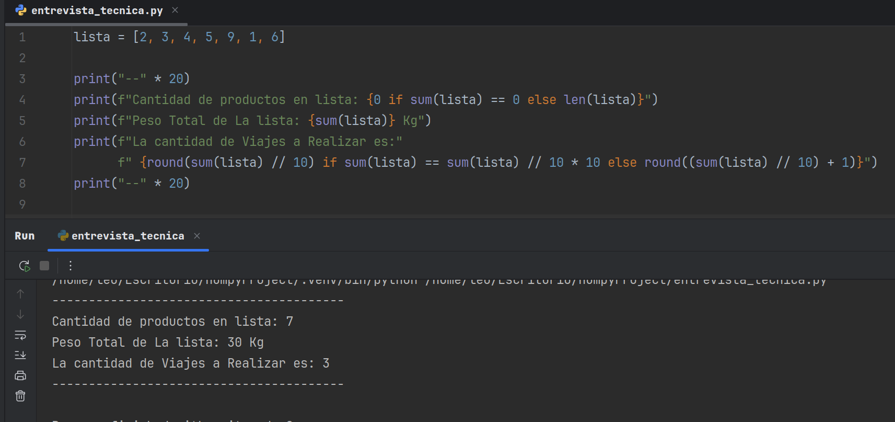

# 📦 Prueba Tecnica -- Optimización de Entrega de Paquetes por peso:
El desafío de minimizar el número de viajes con un límite de peso por 
viaje (a menudo conocido como el "Problema de la Mochila" o "Bin Packing Problem") es un problema 
clásico NP-hard. Una solución verdaderamente óptima implicaría algoritmos más sofisticados para agrupar
inteligentemente los paquetes y maximizar el uso de cada capacidad de 10 kg, tales como:

## First-Fit Decreasing (FFD): 
Ordenar los paquetes por peso en orden descendente y colocar cada paquete en el primer
contenedor (viaje) donde quepa.

## Best-Fit Decreasing (BFD): 
Ordenar los paquetes por peso en orden descendente y colocar cada paquete en el
contenedor donde encaje más ajustadamente (es decir, que deje el menor espacio restante).

Mi implementación actual es un buen punto de partida para una estimación simple basada en el peso total. 
Para una solución a nivel de producción que requiera una verdadera minimización de viajes, se explorarían e 
implementarían estos algoritmos de optimización combinatoria más avanzados.

# ALGORITMO CREADO CON UNA FORMULA SIMPLE PERO EFECTIVA
- Este repositorio contiene un script de Python diseñado para proporcionar una aproximación básica en 
la optimización de entregas de paquetes, considerando límites de peso. El objetivo principal es determinar
 el número de viajes necesarios para transportar una lista dada de paquetes, con cada viaje teniendo una capacidad máxima de peso.

## - ¿Qué Contiene?
## Este script toma una lista de pesos de paquetes 📦 y calcula:

## Cantidad Total de Paquetes 📦: 
El número total de paquetes individuales en la lista.

## Peso Total de la Lista📦: 
El peso acumulado de todos los paquetes.

## Cantidad Estimada de Viajes a Realizar: 
Una aproximación de los viajes mínimos necesarios, asumiendo una distribución
promedio del peso por viaje.
Lógica de Cálculo de Viajes:

El script asume una capacidad máxima de 10 kg por viaje.

Calcula el peso total (sum(lista)).

Luego divide el peso total por 10.

Si el peso total es un múltiplo exacto de 10, usa ese número de viajes.

De lo contrario, redondea al siguiente número entero para contabilizar cualquier peso
restante que requeriría un viaje adicional. Esto se logra añadiendo 1 después de la división
entera o utilizando división de punto float y round() para asegurar un viaje extra para 
cualquier remanente.

- 

- * **Autor: @AndresGolDev** - [**Github link:**]([https://github.com/tu-usuario](https://github.com/AndresGolDev)

